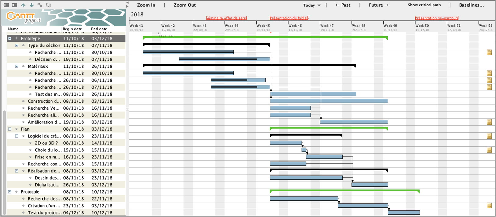

# Status report

- Groupe : x
- Date : DD/MM/YYYY

## Ordre du jour

- [Plan d'ensemble](#plan-d'ensemble)
- [Activités](#activités)
- [Risques et problèmes](#risques-et-problèmes)
- [Discussion de contenu](#discussions-de-contenu)

## Plan d'ensemble

## Activités 

| Activités terminées la semaine passée | Activités planifiées la semaine prochaine | 
| ------ | ------ |
| ...(PS-8/10) | Activité planifiée 1 |
| ... | Activité planifiée 2 |
|  | Activité plantifiée 3 |
|  | Activité plantifiée 4 |

## Risques et problèmes

Sous forme de **tableaux** mais en _Markdown_ pur, **il n'est pas possible d'afficher plusieurs lignes par cellule**.

**Solution 1** : utilisation d'une seule ligne par cellule et de la balise html ` ` pour passer à la ligne

| Impact \ Probability   | Medium   | High   | Issue  |
| ------                 | ------   | ------ | ------ |
| **Medium**             | **X** |- Risque 1 élevé - Risque 2 élevé | |
| **High**               | - Risque 1 - Risque 2 |  | :warning: Problème à grand impact |

**Solution 2** : utilisation d'une rangée intermédiaire vide et de rangées supplémentaires en dessous de la ligne correspondante

| Impact \ Probability 	| Medium 	| High 	| Issue |
| -- 				   	| -- 		| -- 	| -- 	|
|  			    	   	|  		    |  	    |  	    |
| **High** 				| Risque 1 	|   	|   	|
|  				    	| Risque 2 	|   	|   	|
|  					    | 		    |   	| :warning:  Problème à grand impact |
|  				   	    |  		    |  	    |  	    |
| **Medium**			|   **X**	| Risque 1 élevé |   	|
|  						|   		| Risque 2 élevé |   	|

**Solutions alternatives** : faites preuves d'imagination 

**NB** : pour la solution 1, l'impact medium se trouve en rangée 1 tandis que pour la solution 2, c'est l'inverse (cf. graphique du status_report original). A vous de choisir, ce que vous préférez comme solution. 

## Discussions de contenu

- Transfert de connaissance
- Débat
- Décisions / choix à prendre
- Gestion de conflit

