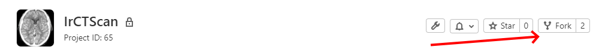

# Projet BA2 Biomed (Template)

Il s'agit d'un template pour créer votre répositoire sur le gitlab du projet BA2. Il suffit de faire un "_Fork_" de ce projet vers un autre projet de votre groupe _Biomedx_.

Un répositoire sert principalement au stockage de fichiers _textes_, **le stockage de fichiers _binaires_ (vidéos, grosses images, etc.) devra donc être fortement limité**.

En pratique, la structure proposée, sous forme de dossiers, est la suivante :
- `Arduino` contient les codes de votre micro-contrôleur ainsi que les librairies : il faudra changer, dans les préférences de l'Arduino IDE, l'emplacement du carnet de croquis par ce dossier.
- `Documentation` contient l'ensemble de votre documentation interne (vos recherches, vos références (liens), vos tests, etc.)
- `Gestion` contient l'ensemble des vos fichiers relatifs à la gestion de projet : "_Status Reports_" en Markdown, "risk and issues logs" en xlsx et votre fichier _GanttProject_ mis à jour régulièrement. 
- `PCControl` contient votre code python permettant le contrôle de votre prototype (mais également le contrôle de vos tests/essais).
- `Simulations` contient l'ensemble de vos fichiers relatifs à vos simulations (à votre simulateur) sur les coupes de fantômes. Vous trouverez également, dans un [sous-dossier](Simulations/Phantoms), l'ensemble des images de coupes que vous devrez traîter.
- `www` contient la documentation mise à disposition du public, typiquement la méthodologie et un  résumé de vos tests avec images et vidéos externes. Il utilise le framework [MkDocs](http://www.mkdocs.org/) pour mettre en ligne le contenu.

**N'hésitez pas à modifier ce template par rapport à vos besoins !**
