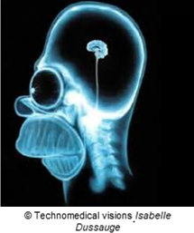

# Tomographie Infrarouge

{align=right}

La tomographie permet d’obtenir le volume d’un objet ainsi que son intérieur grâce à une série d’images de tranches construites à partir de mesures effectuées à l’extérieur de cet objet. En imagerie médicale, cette technique est utilisée, entre autre, dans les CT scanners pour observer l’intérieur du corps humain grâce à des rayons X.

Pour des raisons évidentes de sécurité, le projet sera de réaliser la tranche d’un objet semi-transparent aux infrarouges en transposant le principe de tomographie par rayons X à celui de la lumière. 

## Description

L’objectif du projet est de reconstruire une carte 2D de la densité (optique) d’un objet en utilisant la technique de tomographie. 

{align=right}

Basée sur le principe développé par Mr Radon, il est possible sur base d’un ensemble de vues de profils, de reconstruire une section complète.
Cette technique a été mise en œuvre dans les imageurs médicaux modernes afin de permettre la reconstruction de coupes transversales jusqu’alors impossible à obtenir avec la radiographie classique (sans bien entendu trancher physiquement le spécimen …).

Comme l’utilisation des rayons ionisants représente un risque certain pour la santé, le projet aura recours à la lumière infrarouge au lieu des rayons X et donc devra se limiter aux objets relativement transparents à ces longueurs d’ondes.

##  Cahier des charges 

- réaliser une recherche bibliographique sur les principes de la tomographie, cette recherche doit mettre en évidence les risques liés à l’utilisation de rayonnements ionisants (même si le prototype n’en utilise pas).
- un simulateur (ou des simulations) devra (devront) être réalisé(es) en python afin de se familiariser avec la transformée de radon en utilisant les coupes des fantômes fournis mais également simuler divers problèmes pouvant être rencontrés avec le prototype  (décentrage, saturation, etc.).
- le prototype doit permettre l’acquisition d’une tranche 2D d’un objet de diamètre inférieur à 8 cm composé d’un matériau synthétique translucide aux infra-rouge appelé fantôme (modèles fournis par le LISA). Le contrôle du prototype se fera à partir d’un ordinateur (ou équivalent) où un logiciel de contrôle sera programmé.
- la résolution spatiale doit être de l’ordre du mm.
- une calibration doit être proposée pour le couple émetteur/senseur.
- le coefficient d'atténuation du matériau semi-transparent (PLA bleu) doit être déterminé approximativement (ordre de grandeur) pour la longueur d'onde Ir utilisée.
- le prototype doit être transportable et aucune de ses dimensions ne doit dépasser 50 cm (sans considérer le PC de contrôle).
- pas de parties saillantes pouvant blesser l’utilisateur.
- une fiche détaillée des performances du prototype sera fournie.
- le profil extérieur ainsi que les éléments intérieurs doivent être discernables.
- le temps total d’acquisition et de traitement ne doit pas excéder 15 min.
- un schéma de principe est donné ci-dessous:

- les plans de réalisation doivent être fournis.
- les logiciels développés ainsi que les tests doivent être documentés et placés sur un répositoire partagé (voir ci-après). Pour les tests, la documentation peut être accompagnée de vidéos mises sur des sites en ligne (youtube, etc)
- le logiciel du côté PC devra être réalisé en python.
- une courte séquence vidéo montrant le fonctionnement du prototype sera fournie en fin de projet et pourra être placée sur youtube.
- La hauteur de la coupe devra être réglable manuellement (en option, de manière motorisée).

Bien entendu les options reprises ci-­dessus peuvent être étendues et/ou améliorées, il faut faire preuve d’imagination.

## Répositoire gitlab

Dans le cadre du projet de cette année, un répositoire [gitlab](https://gitlab.ba2.ulb.be) hébergé au sein de l’ULB devra être utilisé pour divers aspects de la réalisation de votre projet :

1. Documentation pour votre recherche bibliographique mais également purement techniques (composants, etc).
2. Le développement de codes informatiques : simulateurs/simulations, code de contrôle pc et microcontrôleur.
3. La publicité de vos essais/tests et du prototype final avec l’aide de pages webs générés à partir de fichier Markdown (utilisation de mkdocs). Des liens vers des vidéos externes youtube (ou autre) doivent être également incluses. 
4. La gestion en continue de votre projet par le biais de “status reports” rédigées sur des fichiers MarkDown et l’inclusion de votre “Risks and Issue Logs”.
5. Remonter les problèmes à l’équipe organisatrice du projet et/ou à votre tuteur.

Diverses informations complémentaires vous seront fournies par le biais d’un site web qui sera mis en ligne vers la fin du mois de septembre et/ou d'une formation. Un template de projet “git” sera également partagé sur le gitlab que vous pourrez “forker” dans votre “dossier” (groupe). D'ici là, **veuillez vous inscrire rapidement sur ce [gitlab](https://gitlab.ba2.ulb.be/users/sign_up) avec votre netid ulb comme _Username_ et votre adresse e-mail ULB.**

## Budget et matériel

Le budget du projet est de maximum 100€. Dans la mesure du possible, la récupération sera donc privilégiée (p/ex pour les matériaux de construction : bois, etc). Des composants électroniques (moteurs, etc) pourront être prêtés par le LISA pour tests s'ils sont disponibles (contact : [Rudy Ercek](mailto:rudy.ercek@ulb.be)) et certains intégrés au prototype (si disponible en quantité suffisante !). Dans les autres cas, le matériel devra être acheté par les étudiants.

En pratique, il conviendra donc de distinguer deux types de budget : celui de tout le matériel acheté (incluant les composants pour tests, non utilisés ou cassés) et le coût réel du prototype intégrant une estimation du prix de tout le matériel utilisé pour sa fabrication (y compris récupération et fourni). Seul ce dernier pourra éventuellement un peu dépasser 100€ si cela se justifie.

Vous recevrez également au début du projet trois fantômes imprimés avec du PLA bleu pour vos tests ainsi qu'une dizaine de plaquettes carrées de ce même PLA d'environ 3cm de côté et de +/- 0.4mm d'épaisseur. Ces plaquettes vous permettront de tester et calibrer votre(vos) capteur(s) ainsi que déterminer approximativement le coefficient d'atténuation du matériau. Veuillez noter que ces plaquettes et fantômes sont très fragiles et sont disponibles en quantité très limitée ! 

A la fin du projet, les prototypes (ou au minimum les composants fournis pour sa construction) et les fantômes seront récupérés par le LISA.

## Ressources

- [Editeur de circuits en ligne](http://www.partsim.com)
- Fournisseurs de composants électroniques :
    - [RS-components](https://befr.rs-online.com/web/) (rapide mais cher)
    - [Aliexpress](https://www.aliexpress.com) (bon marché mais lent)
    - [Cotubex](https://www.cotubex.be) (magasin d'électronique mais fournitures limitée)
    - [Vishay](https://www.vishay.com) (composants électroniques principalement optiques avec possibilité de "samples" gratuits)
- Impressions 3D possible au LISA (contact : [Thomas Vandamme](mailto:thomas.vandamme@ulb.ac.be))
    - Imprimante type Prusa I3 pour objets de dimensiosn inférieures à 15cm
    - Base de données de pièces à imprimer : [thingiverse](https://www.thingiverse.com)
    - Création de pièces en ligne : [TinkerCad](https://www.tinkercad.com)
    - Logiciel gratuit de conception 3D : [FreeCad](https://www.freecadweb.org)
    - Logiciel (license universitaire) de conception 3D : [Solidworks](https://www.solidworks.com/fr)
- Impressions, découpes .. au FabLab de l'ulb

## Personnes ressources

- Recherche bibliographique : [Axel Dero](mailto:axel.dero@ulb.be)
- Electronique : [Michel Osée](mailto:michel.osee@ulb.be)
- Technicien en électronique : [Geoffrey Vanbienne](mailto:geoffrey.vanbienne@ulb.be)
- Programmation (python, arduino) : [Olivier Debeir](mailto:olivier.debeir@ulb.be), [Rudy Ercek](mailto:rudy.ercek@ulb.be)
- Gestion du projet : [Daniele Bonatto](mailto:daniele.bonatto@ulb.be), [Rudy Ercek](mailto:rudy.ercek@ulb.be), [Adrien Foucart](mailto:adrien.foucart@ulb.be), [Maxime Verstraeten](mailto:maxime.verstraeten@ulb.be)

## Calendrier

Voir guide du projet dans l'[Université Virtuelle](http://uv.ulb.ac.be)

**Date de la dernière révision de l'énoncé :**  {{ git_revision_date }}
